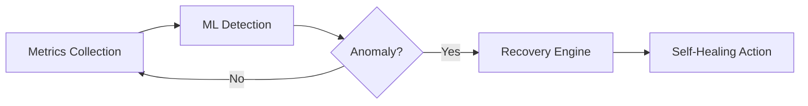

# Aegis Sentinel

[](https://python.org)
[](LICENSE)
[](https://github.com/PkLavc/aegis-sentinel)

## Executive Summary

Aegis Sentinel is a high-reliability infrastructure monitoring and auto-healing engine designed to ensure business continuity and infrastructure resilience in enterprise environments. This system implements advanced anomaly detection algorithms and automated recovery mechanisms to prevent catastrophic downtime in digital services.

The platform demonstrates advanced engineering principles suitable for international standards, particularly aligned with EB-2 NIW requirements for demonstrating exceptional ability in systems engineering and infrastructure automation.

## Engineering Specifications

### Technical Architecture

Aegis Sentinel employs a modular, service-oriented architecture with three core components:

1. **Monitor Service**: Real-time system metrics collection
2. **ML-Anomaly Detection**: Machine learning-based anomaly identification
3. **Recovery Engine**: Automated remediation and healing actions

### Core Technologies

- **Python 3.11+** with strict type hinting
- **Structured JSON logging** for enterprise auditability
- **Isolation Forest** and statistical anomaly detection
- **Docker container management** for automated recovery
- **Comprehensive testing** with pytest framework

### Visual Workflow


### System Requirements

- Python 3.11 or higher
- Docker (for containerized recovery actions)
- Standard Python libraries: psutil, numpy, scikit-learn
- Optional: Redis for distributed caching

## National Interest Context

In today's digital economy, infrastructure reliability is critical for maintaining essential services. Aegis Sentinel addresses the national interest by:

- **Preventing catastrophic downtime** in critical digital infrastructure
- **Reducing economic impact** of system failures through rapid automated recovery
- **Enhancing cybersecurity resilience** through proactive anomaly detection
- **Demonstrating technological leadership** in infrastructure automation

### Engineering Impact Metrics
| Metric | Target | National Interest Benefit |
| :--- | :--- | :--- |
| **Detection Latency** | < 2.0s | Real-time response to critical failures |
| **False Positive Rate** | < 5% | Minimizes operational disruption |
| **Recovery Success** | > 95% | Ensures high availability for essential services |

The system's ability to detect and remediate issues before they escalate to service outages directly contributes to the stability and reliability of digital services that are essential to modern society.

## Installation

```bash
git clone https://github.com/PkLavc/aegis-sentinel.git
cd aegis-sentinel
python -m venv venv
source venv/bin/activate  # On Windows: venv\Scripts\activate
pip install -r requirements.txt
```

## Usage

### Basic Usage

```python
from src.main import AegisSentinel

# Initialize the system with default configuration
sentinel = AegisSentinel()

# Start monitoring
await sentinel.start()

# The system will automatically detect anomalies and trigger recovery
# Monitor runs in the background and logs all activities
```

### Advanced Configuration

```python
from src.main import AegisSentinel
from src.monitor import MonitoringConfig
from src.detector import DetectionConfig
from src.healer import RecoveryConfig

# Custom configuration
monitoring_config = MonitoringConfig(
    collection_interval=5.0,  # Check every 5 seconds
    api_endpoints=["https://api.example.com/health"],
    enable_network_monitoring=True,
    enable_disk_monitoring=True
)

detection_config = DetectionConfig(
    isolation_contamination=0.1,
    statistical_threshold_multiplier=3.0,
    min_samples_for_detection=50
)

recovery_config = RecoveryConfig(
    enable_docker_recovery=True,
    enable_cache_recovery=True,
    max_concurrent_actions=3
)

# Initialize with custom configuration
sentinel = AegisSentinel(
    monitoring_config=monitoring_config,
    detection_config=detection_config,
    recovery_config=recovery_config
)

# Start monitoring
await sentinel.start()

# Get service status
status = sentinel.get_status()
print(f"Service running: {status['service_status']}")
print(f"Anomalies detected: {status['anomalies_detected']}")
print(f"Recovery success rate: {status['success_rate']:.1f}%")
```

### Programmatic Usage

```python
import asyncio
from src.main import aegis_sentinel_context

async def main():
    # Use context manager for automatic cleanup
    async with aegis_sentinel_context() as sentinel:
        print("Aegis Sentinel is running...")
        
        # Monitor for 60 seconds
        await asyncio.sleep(60)
        
        # Get current status
        status = sentinel.get_status()
        print(f"Uptime: {status['uptime_seconds']} seconds")

if __name__ == "__main__":
    asyncio.run(main())
```

## Configuration Options

### Monitoring Configuration

- `collection_interval`: Time between metric collections (default: 5.0 seconds)
- `api_endpoints`: List of API endpoints to monitor for latency and availability
- `enable_network_monitoring`: Enable network metrics collection
- `enable_disk_monitoring`: Enable disk usage monitoring

### Detection Configuration

- `isolation_contamination`: Expected proportion of anomalies in the data (default: 0.1)
- `isolation_n_estimators`: Number of trees in Isolation Forest (default: 100)
- `statistical_threshold_multiplier`: Standard deviation multiplier for statistical detection (default: 3.0)
- `min_samples_for_detection`: Minimum samples required before detection starts (default: 50)

### Recovery Configuration

- `enable_docker_recovery`: Enable Docker container restart recovery
- `enable_cache_recovery`: Enable cache flushing recovery
- `enable_service_recovery`: Enable system service restart recovery
- `max_concurrent_actions`: Maximum concurrent recovery actions (default: 3)
- `action_timeout`: Default timeout for recovery actions (default: 120.0 seconds)

## Testing

Run the test suite:

```bash
# Using the simple test runner
python run_tests.py

# Using pytest (if available)
pytest tests/

# Run specific test modules
pytest tests/test_monitor.py
pytest tests/test_detector.py
```

## Logging

Aegis Sentinel uses structured JSON logging for enterprise auditability:

```json
{
  "timestamp": "2026-02-18T10:15:30Z",
  "level": "WARNING",
  "event": "anomaly_detected",
  "metric": "memory_usage",
  "value": 92.5,
  "action": "docker_container_restart",
  "target": "api_gateway_v1"
}
```

```python
import logging

# Configure logging
logging.basicConfig(
    level=logging.INFO,
    format='%(asctime)s - %(name)s - %(levelname)s - %(message)s'
)

# Log files are automatically created as 'aegis_sentinel.log'
```

Log levels:
- `INFO`: General operation status and recovery actions
- `WARNING`: Anomaly detection events
- `ERROR`: System errors and failed recovery actions
- `DEBUG`: Detailed metric collection and detection information

## Contributing

This project follows strict professional standards. All contributions must include:

- Comprehensive unit tests
- Type annotations for all functions
- Structured logging for all operations
- Documentation for new features

## License

MIT License - see LICENSE file for details.

## Author

**Patrick - Computer Engineer** To view other projects and portfolio details, visit:
[https://pklavc.github.io/projects.html](https://pklavc.github.io/projects.html)

---

*This project is part of a professional portfolio demonstrating advanced systems engineering capabilities for high-availability infrastructure.*
